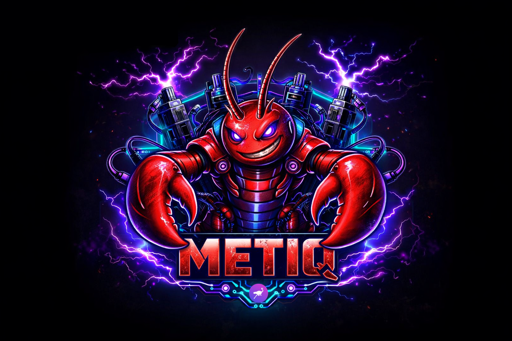

# Metiq - Nostr-native AI Agent Runtime



**Nostr-native AI agent runtime.** A full Go port of OpenClaw with first-class Nostr relay transport, end-to-end encryption, and multi-agent orchestration built in.

## What it is

Metiq runs AI agents that communicate over the Nostr relay network. Any device running `metiqd` is instantly addressable by its Nostr pubkey — no pairing servers, no proprietary cloud, no fixed IPs. Agents receive tasks via NIP-17 DMs, channel messages (Telegram, Discord, Slack, etc.), or the local admin API, and reply through the same channels.

## Feature highlights

| Area | What's included |
|------|----------------|
| **Agent runtime** | Multi-provider LLM support (OpenAI, Anthropic, Google Gemini, Groq, Mistral, Moonshot, Minimax, local HTTP); streaming responses via SSE; tool/function calling; per-session memory |
| **Channels** | Telegram, Discord, Slack, WhatsApp, Email (IMAP+SMTP); typing indicators, reactions, threads, message editing, multi-account |
| **Memory** | Full-text search index; explicit memory extraction; auto-compaction background goroutine; context assembly with turn budgets |
| **Multi-agent** | ACP (Agent Control Protocol) over Nostr DMs; `acp.dispatch` for single delegation; `acp.pipeline` for sequential/parallel multi-step workflows; in-flight task dispatcher with timeout |
| **Security** | NIP-44 E2E encryption for channel messages; exec approval modal; security audit module; secret store |
| **Plugin system** | Goja (embedded JS) and Node.js plugin runtimes; remote registry (`plugins.registry.list/get/search`); URL install (`source=url`); npm install |
| **Sandbox** | `NopSandbox` (os/exec + timeout) and `DockerSandbox` (ephemeral container, CPU/memory caps, optional network isolation); `sandbox.run` gateway method |
| **Streaming** | Server-Sent Events from OpenAI-compatible providers; `chat.chunk` WebSocket events for incremental display; streaming runtime interface |
| **Web UI** | Embedded dark-theme chat interface; sessions sidebar; streaming text bubbles; exec approval modal; channels/agents tabs |
| **CLI** | 40+ commands across agents, channels, sessions, cron, nodes, config, plugins, secrets, security, and more |
| **Nostr transport** | NIP-17 gift-wrapped DMs; NIP-44 encryption; NIP-86-style control RPC; Nostr-backed state store |

---

## Quick start

### Prerequisites

- Go 1.21+
- A Nostr private key (hex or `nsec…`)

### Build

```sh
git clone https://github.com/your-org/metiq
cd metiq
go build ./cmd/metiqd ./cmd/metiq
```

### Minimal bootstrap config

Create `~/.metiq/bootstrap.json`:

```json
{
  "private_key": "env://METIQ_PRIVATE_KEY",
  "relays": ["wss://relay.damus.io", "wss://nos.lol"],
  "admin_listen_addr": "127.0.0.1:8787",
  "admin_token": "your-secret-token"
}
```

```sh
export METIQ_PRIVATE_KEY="your-hex-or-nsec-private-key"
./metiqd
```

### Check it's running

```sh
./metiq status
./metiq health
```

---

## Configuration

metiq reads a runtime config document from Nostr (kind `30078`). The config is live-reloadable — changes written via the admin API take effect without a daemon restart.

Key config sections:

```json
{
  "version": 1,
  "agents": {
    "default": {
      "model": "claude-opus-4",
      "system_prompt": "You are a helpful assistant.",
      "providers": { "anthropic": { "api_key": "env://ANTHROPIC_API_KEY" } }
    }
  },
  "channels": {
    "my-telegram": {
      "kind": "telegram",
      "token": "env://TELEGRAM_BOT_TOKEN",
      "enabled": true
    }
  },
  "sandbox": {
    "driver": "nop",
    "timeout_s": 30
  }
}
```

See `docs/MIGRATION_FROM_OPENCLAW.md` for a full field reference and OpenClaw migration guide.

---

## CLI reference

```
metiq <command> [flags]

Daemon:
  status                    show pubkey, uptime, relay connections
  health                    ping the admin API
  logs [--lines N]          tail recent daemon log lines
  daemon start/stop/restart daemon lifecycle management

Agents:
  agents list               list configured agents
  agents create/update/delete manage agent definitions
  models list [--agent ID]  list available LLM models

Chat & sessions:
  sessions list             list conversation sessions
  sessions get <id>         show a session's turns
  sessions export <id>      export session to Markdown or HTML

Channels:
  channels list             list configured channels and status
  channels send <ch> <msg>  send a message to a channel

Remote nodes (Nostr-native — no pairing required):
  nodes list                list known remote metiq agents
  nodes add <npub>          register a remote agent by Nostr pubkey
  nodes status <npub>       check a remote agent's health
  nodes send <npub> <msg>   send a task to a remote agent via DM

Plugins:
  plugins list              list installed plugins
  plugins install [flags]   install from path/archive/npm/URL
  plugins search --q <kw>   search Nostr plugin registry

Config:
  config get [key]          read config value (dot-notation)
  config set <key> <value>  set config value
  config validate           validate config file
  config import/export      bulk import/export

Secrets:
  secrets list/get/set      manage named secrets

Security:
  security audit            run local security posture checks

Other:
  cron list/add/remove      manage scheduled tasks
  approvals list/resolve    manage exec approval requests
  doctor memory-status      inspect memory index health
  qr                        display QR code for daemon pubkey
  completion bash|zsh|fish  generate shell completion script
  gw <method> [params]      call any gateway method directly
  update                    check for daemon updates
```

---

## Channel extensions

Built-in channel plugins and their capabilities:

| Channel | Typing | Reactions | Threads | Edit | Multi-account |
|---------|--------|-----------|---------|------|---------------|
| Telegram | ✅ | ❌ | ✅ | ✅ | ✅ |
| Discord | ✅ | ✅ | ✅ | ✅ | ✅ |
| Slack | ❌ | ✅ | ✅ | ✅ | ✅ |
| WhatsApp | ❌ | ❌ | ❌ | ❌ | ❌ |
| Email (IMAP+SMTP) | ❌ | ❌ | ✅ | ❌ | ✅ |

### End-to-end encryption

Any channel can be wrapped with NIP-44 E2E encryption. Add to the channel config:

```json
{
  "e2e_private_key": "env://MY_E2E_KEY",
  "e2e_peer_pubkey": "<hex-pubkey-of-remote-party>"
}
```

Outbound messages are encrypted to `nip44:<ciphertext>`; inbound messages are decrypted transparently before reaching the agent.

---

## Multi-agent orchestration (ACP)

Agents can delegate tasks to other metiq agents (local or remote) via Nostr DMs:

```json
// acp.dispatch — fire-and-forget or blocking
{ "method": "acp.dispatch", "params": { "peer_pub_key": "<npub>", "instructions": "summarise this", "wait": true } }

// acp.pipeline — sequential (each step gets previous result as context)
{ "method": "acp.pipeline", "params": {
    "steps": [
      { "peer_pub_key": "<npub1>", "instructions": "research X" },
      { "peer_pub_key": "<npub2>", "instructions": "write a report" }
    ]
  }
}

// acp.pipeline — parallel
{ "method": "acp.pipeline", "params": { "steps": [...], "parallel": true } }
```

Agents also have access to the `acp.delegate` built-in tool, letting LLMs orchestrate sub-agents inline during a turn.

---

## Plugin system

### Install a plugin

```sh
# From a local path (goja JS or Node.js)
metiq plugins install --id my-plugin --source path --source-path ./my-plugin/

# From npm
metiq plugins install --id my-plugin --source npm --spec my-npm-package@1.0.0

# From a URL (single JS file or archive)
metiq plugins install --id my-plugin --source url --url https://example.com/plugin.js

# From Nostr plugin registry
metiq plugins search --q weather
metiq plugin-install --pubkey <author-npub> --id weather
```

### Remote registry

Configure a registry URL in your config:
```json
{ "extensions": { "registry_url": "https://your-registry.com/plugins/index.json" } }
```

Or pass it per-request: `plugins.registry.list` / `plugins.registry.get` / `plugins.registry.search`.

---

## Sandbox execution

The `sandbox.run` gateway method executes commands with isolation:

```json
{ "method": "sandbox.run", "params": {
    "cmd": ["python3", "-c", "print('hello')"],
    "driver": "docker",
    "timeout_s": 10
  }
}
```

Configure defaults in your daemon config:
```json
{
  "sandbox": {
    "driver": "docker",
    "docker_image": "python:3.12-slim",
    "memory_limit": "256m",
    "cpu_limit": "0.5",
    "network_disabled": true,
    "timeout_s": 30
  }
}
```

Drivers: `nop` (os/exec, default) · `docker` (ephemeral container, requires Docker CLI).

---

## Gateway API

The admin HTTP API and Nostr control-RPC surface share the same method namespace. Call any method via `metiq gw <method> [key=value ...]` or POST to `/call`.

Key method groups:

| Prefix | Methods |
|--------|---------|
| `chat.*` | `chat.send`, `chat.history`, `chat.abort` |
| `sessions.*` | list, get, patch, reset, delete, compact, spawn, export |
| `agents.*` | list, create, update, delete, assign, files |
| `channels.*` | list, status, send, join, leave |
| `config.*` | get, put, set, patch, schema |
| `memory.*` | search, compact |
| `tools.*` | catalog, profile.get, profile.set |
| `plugins.*` | install, uninstall, update, registry.list/get/search |
| `acp.*` | register, unregister, peers, dispatch, pipeline |
| `sandbox.*` | run |
| `cron.*` | list, add, update, remove, run |
| `exec.approval.*` | request, resolve |
| `node.*` / `nodes.*` | list, describe, rename, invoke |
| `skills.*` | status, bins, install, update |

WebSocket push events: `chat.message`, `chat.chunk` (streaming), `agent.status`, `exec.approval.requested`, `config.updated`, `plugin.loaded`.

---

## Streaming responses

When the configured LLM provider supports SSE (`stream: true`), metiq delivers tokens incrementally:

1. The provider streams SSE chunks over HTTP.
2. The runtime emits `chat.chunk` WebSocket events with `{ text, done }` payloads.
3. The Web UI renders a live-updating bubble with a blinking cursor.
4. The channel handle receives the final assembled text.

---

## Nostr-native remote nodes

Every `metiqd` instance is reachable via its Nostr pubkey over NIP-17 DMs. There is no separate pairing protocol:

```sh
# Register a remote agent you want to work with
metiq nodes add npub1abc... --name "my-pi"

# Send it a task
metiq nodes send npub1abc... "run the daily report"

# Check its health
metiq nodes status npub1abc...
```

Remote agents participate in ACP pipelines the same way as local agents — just specify their `npub` as the `peer_pub_key`.

---

## Development

```sh
# Run all tests
go test ./...

# Build both binaries
go build ./cmd/metiqd ./cmd/metiq

# Run parity gate
bash ./scripts/ci-parity.sh
```

Key packages:

| Package | Purpose |
|---------|---------|
| `internal/agent` | LLM provider adapters, runtime, streaming, tool registry |
| `internal/acp` | Multi-agent dispatcher and pipeline orchestrator |
| `internal/gateway/` | WS server, admin HTTP, method schema/decode, channel extensions |
| `internal/memory` | FTS index, memory extraction, auto-compaction |
| `internal/nostr/secure` | NIP-44 codecs, E2E encrypted channel handles |
| `internal/plugins/` | Goja/Node.js runtimes, installer (npm/URL/archive), Nostr registry |
| `internal/sandbox` | NopSandbox, DockerSandbox, SandboxRunner interface |
| `internal/extensions/` | Telegram, Discord, Slack, WhatsApp, Email channel plugins |
| `internal/store/state` | Nostr-backed config/session/memory document store |

See `docs/MIGRATION_FROM_OPENCLAW.md` for the full OpenClaw → Metiq migration guide.
