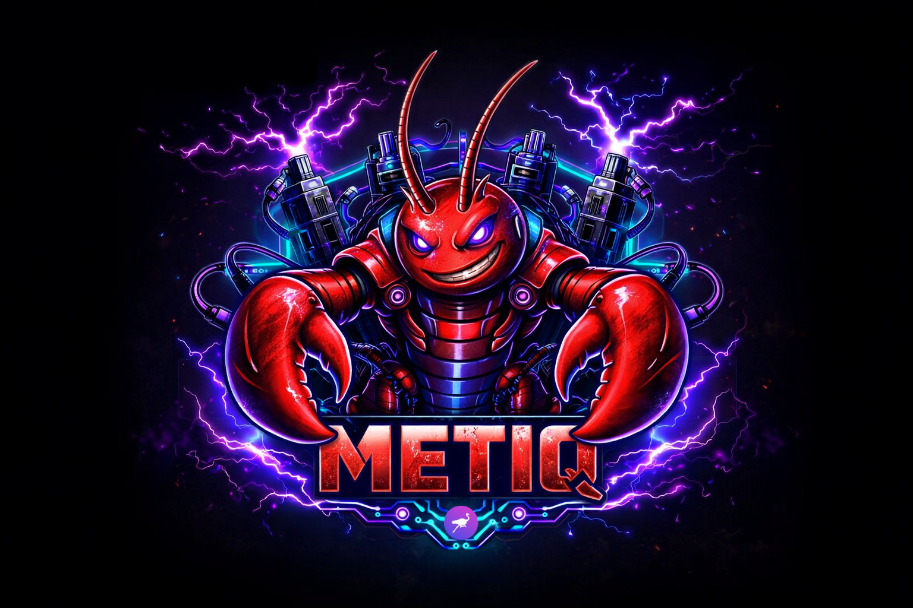

# Metiq - Nostr-native AI Agent Runtime



**Nostr-native AI agent runtime.** A full Go port of OpenClaw with first-class Nostr relay transport, end-to-end encryption, and multi-agent orchestration built in.

## What it is

Metiq runs AI agents that communicate over the Nostr relay network. Any device running `metiqd` is instantly addressable by its Nostr pubkey — no pairing servers, no proprietary cloud, no fixed IPs. Agents receive tasks via NIP-17 DMs, channel messages (Telegram, Discord, Slack, etc.), or the local admin API, and reply through the same channels.

## Feature highlights

| Area | What's included |
|------|----------------|
| **Agent runtime** | Native LLM providers: OpenAI (Chat + Responses), Anthropic (API key + OAuth), Google Gemini + Vertex, Azure OpenAI, Mistral, Groq, Moonshot/Kimi, Minimax, GitHub Copilot, DeepInfra, Fireworks, xAI Grok, LM Studio, Ollama, local HTTP; model catalog with provider fallback chains; streaming tool calls with typed events and tool-call repair; agentic loop with context budgets, pruning, and preflight checks |
| **Channels** | 23 built-in channel extensions: Telegram, Discord, Slack, WhatsApp Cloud API, unofficial WhatsApp linked device, Email (IMAP+SMTP), Signal, Matrix, Mattermost, Microsoft Teams, Google Chat, BlueBubbles, iMessage, IRC, LINE, Feishu, Nextcloud Talk, QQ, Synology Chat, Twitch, Zalo, SMS, ZaloUser; event-driven inbound delivery; typing indicators, reactions, threads, message editing, media contracts, multi-account |
| **Memory** | Pluggable backends: SQLite FTS + sqlite-vec, embedded LanceDB, Qdrant, wiki vault; hybrid vector + keyword retrieval with MMR ranking; active memory recall; embedding cache; auto-compaction; team memory sync over Nostr; MCP memory session bootstrap |
| **Multi-agent** | ACP (Agent Control Protocol) over Nostr DMs; `acp.dispatch` for single delegation; `acp.pipeline` for sequential/parallel multi-step workflows; router policy; persisted pipeline flows with mirrored child tasks; commitment tracking with heartbeat delivery; JSONL session-tree harness |
| **Security** | NIP-44 E2E encryption for channel messages; exec approvals enriched with automatic command analysis; exec policy management; security guidance hook and policy doctor; sandbox network-policy hardening; plugin trust decisions; security audit module; secret store |
| **Lightning & payments** | Dedicated payment-capable `l402_fetch` with L402/LSAT challenge handling, NWC or LND invoice payment, spend limits, and protected token caching; ordinary `web_fetch` never pays; curated `lnd_*` and Taproot Assets `tap_*` gRPC tools with read-only defaults and opt-in receive/spend/admin toolsets |
| **Plugin system** | Goja (embedded JS) and Node.js plugin runtimes; unified plugin lifecycle; manifest validation and build/package tooling; plugin trust store; OpenClaw plugin contract and Claude plugin support; hooks; registry install flows (npm/git/URL/archive/path + Nostr registry) |
| **Sandbox** | Sandbox backend registry with runtime management; `nop` (os/exec + timeout) and hardened Docker backends; filesystem bridge; browser sandbox spec; workspace lifecycle and pruning; network policy controls; `sandbox.run` gateway method |
| **Streaming** | Server-Sent Events from streaming providers; typed streaming events; `chat.chunk` WebSocket events for incremental display; streaming tool calls |
| **Web UI** | Embedded dark-theme chat interface; sessions sidebar; streaming text bubbles; exec approval modal; management views for channels, agents, and plugins; slash-command catalog |
| **CLI** | 50+ command groups across daemon, agents, models, channels, skills, config, secrets, MCP, plugins, tasks, memory, sandbox, security, observability, and more |
| **Nostr transport** | NIP-17 gift-wrapped DMs and NIP-04 compatibility paths; NIP-44 encryption; NIP-11 relay info; NIP-86 management API; NIP-89 handler discoverability + DVM handler; NIP-98 HTTP auth; NIP-51 lists, NIP-58 badges, NIP-60/61 Cashu wallets & nutzaps; zaps; canonical Nostr-native event kinds via ContextVM (cascadia-go); Nostr-backed state store |

---

## Quick start

### Prerequisites

- Go 1.21+
- A Nostr private key (hex or `nsec…`)

### Build

```sh
git clone https://github.com/your-org/metiq
cd metiq
go build ./cmd/metiqd ./cmd/metiq
```

### Minimal bootstrap config

Create `~/.metiq/bootstrap.json` with your explicit relay set:

```json
{
  "private_key": "env://METIQ_PRIVATE_KEY",
  "relays": ["wss://<relay-1>", "wss://<relay-2>", "wss://<relay-4>", "wss://<relay-5>"],
  "admin_listen_addr": "127.0.0.1:8787",
  "admin_token": "your-secret-token"
}
```

For Nostr-first raw control calls with `metiq gw`, add:

```json
{
  "control_target_pubkey": "npub1...daemon...",
  "control_signer_url": "env://METIQ_CONTROL_CALLER_NSEC"
}
```

```sh
export METIQ_PRIVATE_KEY="your-hex-or-nsec-private-key"
./metiqd
```

### Check it's running

```sh
./metiq status
./metiq health
```

### Nostr-first control path

`metiq gw` now defaults to transport `auto`:

- if `control_target_pubkey` is configured, raw gateway method calls go over signed Nostr control RPC
- if `control_target_pubkey` is not configured, `metiq gw` falls back to local HTTP `POST /call`
- `--transport http` forces the compatibility HTTP path

The Nostr control caller must be a different pubkey from the target daemon. Use `control_signer_url` or `--control-signer-url` when the operator/automation client should sign separately from the daemon.

```sh
# Auto-select Nostr when control_target_pubkey is configured
./metiq gw status.get

# Force Nostr with explicit overrides
./metiq gw \
  --transport nostr \
  --control-target-pubkey npub1...daemon... \
  --control-signer-url env://METIQ_CONTROL_CALLER_NSEC \
  status.get

# Force local HTTP compatibility mode
./metiq gw --transport http status.get
```

See `docs/gateway/nostr-control.md` for the operator and migration guide.

---

## Configuration

metiq reads a runtime config document from Nostr (kind `30078`). The config is live-reloadable — changes written via the admin API take effect without a daemon restart.

Key config sections:

```json
{
  "version": 1,
  "agents": {
    "default": {
      "model": "claude-opus-4",
      "system_prompt": "You are a helpful assistant.",
      "providers": { "anthropic": { "api_key": "env://ANTHROPIC_API_KEY" } }
    }
  },
  "channels": {
    "my-telegram": {
      "kind": "telegram",
      "token": "env://TELEGRAM_BOT_TOKEN",
      "enabled": true
    }
  },
  "sandbox": {
    "driver": "nop",
    "timeout_s": 30
  }
}
```

See `docs/MIGRATION_FROM_OPENCLAW.md` for a full field reference and OpenClaw migration guide.

---

## Lightning, L402, and Taproot Assets

Metiq keeps paid HTTP access separate from ordinary browsing:

- `web_fetch` is non-paying and never handles an invoice.
- `l402_fetch` is a distinct, destructive tool that can pay one L402 or LSAT challenge and retry once, but only for exact HTTPS origins approved by the operator.
- L402 payments can use a named NWC wallet or an LND profile. Amount, fee, hourly-spend, network, expiry, and timeout policies are checked before payment.
- LND and tapd profiles expose stable curated `lnd_*` and `tap_*` tools from bundled descriptors. Omitting `toolsets` exposes only the `read` set; `receive`, `spend`, and `admin` are explicit opt-ins.

A minimal NWC-backed L402 configuration is:

```json
{
  "extra": {
    "lightning": {
      "wallets": {
        "default": {
          "type": "nwc",
          "network": "mainnet",
          "uri": "env:METIQ_NWC_URI",
          "trust_wallet_fee_limit": true
        }
      },
      "l402": {
        "enabled": true,
        "payer": "default",
        "allowed_origins": ["https://api.example.com"],
        "max_invoice_msat": 100000,
        "max_fee_msat": 5000,
        "max_spend_msat_per_hour": 500000,
        "payment_timeout_ms": 30000
      }
    }
  }
}
```

L402 bearer tokens default to protected OS-backed secret storage and are never silently written to the plaintext fallback. Choose an in-memory cache explicitly if protected storage is unavailable and restart persistence is not required.

See the [Lightning & Payments configuration guide](docs/reference/CONFIGURATION_GUIDE.md#lightning--payments) for wallet and gRPC profile fields. Descriptor pins, curated tool names, licenses, and regeneration instructions live in [`internal/lightning/descriptors/README.md`](internal/lightning/descriptors/README.md).

---

## CLI reference

```
metiq <command> [flags]

Daemon status:
  status                    show pubkey, uptime, relay connections
  health                    ping the admin API
  logs [--lines N]          tail recent daemon log lines
  observe                   inspect structured runtime events/logs (--event, --wait)
  daemon start/stop/restart daemon lifecycle management

Agents & models:
  agents list/create/update/delete   manage agent definitions
  models list [--agent ID]  list available LLM models (native model catalog)

Chat & sessions:
  sessions list             list conversation sessions
  sessions get <id>         show a session's turns
  sessions export <id>      export session to Markdown or HTML
  transcripts list/export   inspect and export stored transcripts
  trajectory                session trajectory export and cleanup
  message send / send       send messages through the gateway

Channels & skills:
  channels list             list configured channels and status
  skills list/status/install/enable/disable   skill management
  hooks                     list installed hooks

Remote nodes (Nostr-native — no pairing required):
  nodes list                list known remote metiq agents
  nodes add <npub>          register a remote agent by Nostr pubkey
  nodes status <npub>       check a remote agent's health
  nodes send <npub> <msg>   send a task to a remote agent via DM

Plugins:
  plugins list              list installed plugins
  plugins install [flags]   install from npm/git/url/archive/path
  plugins build <path>      validate, build, and package a plugin
  plugins validate <manifest>  validate a plugin manifest
  plugins doctor            run plugin diagnostics
  plugin-search --q <kw>    search Nostr plugin registry

Config:
  config get [key]          read config value (dot-notation)
  config set <key> <value>  set config value
  config validate           validate config file
  config import/export      bulk import/export
  lists                     runtime list docs
  setup / onboard           interactive first-run setup

Secrets & MCP:
  secrets list/get/set      manage named secrets
  mcp                       MCP server management

Memory:
  memory                    memory management (search, health, compact, eval)

Tasks & QA:
  tasks                     task management
  qa                        run deterministic QA scenario packs

Multi-agent & sandbox:
  acp dispatch/pipeline/status   run and inspect ACP-backed coding agents
  commitments list/add/status    manage inferred follow-up commitments
  sandbox run/status        manage sandbox containers for agent isolation

Security:
  security audit            run local security posture checks
  security doctor           run policy conformance doctor
  exec-policy               exec approval policy management
  approvals list/resolve    manage exec approval requests

Other:
  cron list/add/remove      manage scheduled tasks
  doctor                    system health diagnostics
  diagnostics               export support diagnostic bundle
  backup                    create or restore local metiq backups
  migrate                   migrate an OpenClaw agent to Metiq
  keygen                    generate keys
  qr                        display QR code for daemon pubkey
  completion bash|zsh|fish  generate shell completion script
  gw <method> [params]      call any gateway method directly (auto prefers Nostr when control_target_pubkey is configured; use --transport http to force /call)
  update                    check for daemon updates
```

---

## Channel extensions

23 built-in channel plugins, each config-gated (only compiled-in extensions matching a configured `nostr_channels` entry are instantiated):

| | | | |
|---|---|---|---|
| Telegram | Discord | Slack | WhatsApp Cloud API |
| Email (IMAP+SMTP) | Signal | Matrix | Mattermost |
| Microsoft Teams | Google Chat | BlueBubbles | iMessage |
| IRC | LINE | Feishu | Nextcloud Talk |
| QQ | Synology Chat | Twitch | Zalo |
| SMS | ZaloUser | WhatsApp linked device (unofficial) | |

Per-channel capabilities (typing indicators, reactions, threads, message editing, media, multi-account) are declared through shared channel access and media contracts. Mattermost, Signal, BlueBubbles, and Email use event-driven inbound delivery rather than polling.

> **WhatsApp linked-device warning:** the `whatsappweb` Baileys transport may
> violate WhatsApp's terms and can cause account restriction or permanent bans.
> Use a separate number you can afford to lose. See
> [the setup and risk guide](docs/channels/whatsappweb.md). The `whatsapp`
> extension remains the official Meta Cloud API channel.

### End-to-end encryption

Any channel can be wrapped with NIP-44 E2E encryption. Add to the channel config:

```json
{
  "e2e_private_key": "env://MY_E2E_KEY",
  "e2e_peer_pubkey": "<hex-pubkey-of-remote-party>"
}
```

Outbound messages are encrypted to `nip44:<ciphertext>`; inbound messages are decrypted transparently before reaching the agent.

---

## Multi-agent orchestration (ACP)

Agents can delegate tasks to other metiq agents (local or remote) via transport-neutral ACP messages sent over Nostr DMs:

```json
// acp.dispatch — fire-and-forget or blocking
{ "method": "acp.dispatch", "params": { "peer_pub_key": "<npub>", "instructions": "summarise this", "wait": true } }

// acp.pipeline — sequential (each step gets previous result as context)
{ "method": "acp.pipeline", "params": {
    "steps": [
      { "peer_pub_key": "<npub1>", "instructions": "research X" },
      { "peer_pub_key": "<npub2>", "instructions": "write a report" }
    ]
  }
}

// acp.pipeline — parallel
{ "method": "acp.pipeline", "params": { "steps": [...], "parallel": true } }
```

Agents also have access to the `acp.delegate` built-in tool, letting LLMs orchestrate sub-agents inline during a turn.

Recent ACP upgrades:

- **Router policy** — configurable routing decisions for inbound ACP requests
- **Persisted pipeline flows** — pipeline state survives daemon restarts, and child tasks are mirrored into the local task store
- **Commitments** — follow-up commitments are inferred, persisted, and delivered with heartbeats (`metiq commitments list/add/status`)
- **Session-tree harness** — JSONL session trees for inspecting multi-agent runs

### ACP transport compatibility

- `acp.transport` supports `auto`, `nip17`, or `nip04`.
- `auto` consults the target peer's advertised `dm_schemes` from kind:30317 capability events and chooses a compatible transport family.
- Because kind:30317 currently advertises DM schemes as a set rather than an ordered preference list, `auto` prefers `nip17` when a peer advertises both `nip17` and `nip04`, and falls back to `nip04` when that is the only discovered compatible option.
- When a peer has not published capability metadata yet, `auto` uses the compatibility-safe fallback and prefers `nip04` before `nip17`.
- For cross-runtime fleets such as OpenClaw, set `acp.transport: nip04` to force the NIP-04 compatibility profile end to end.

---

## Plugin system

### Install a plugin

```sh
# From a local path (goja JS or Node.js)
metiq plugins install --id my-plugin --source path --source-path ./my-plugin/

# From npm
metiq plugins install --id my-plugin --source npm --spec my-npm-package@1.0.0

# From a URL (single JS file or archive)
metiq plugins install --id my-plugin --source url --url https://example.com/plugin.js

# From Nostr plugin registry
metiq plugin-search --q weather
metiq plugin-install --pubkey <author-npub> --id weather

# Author tooling
metiq plugins build ./my-plugin/       # validate, build, and package
metiq plugins validate ./manifest.json # validate a manifest
metiq plugins doctor                   # run plugin diagnostics
```

### Lifecycle, trust, and contracts

- **Unified lifecycle** — plugins move through a single install → enable → run → disable → uninstall state machine shared by all runtimes
- **Trust store** — install-time trust decisions are recorded and enforced before a plugin can execute
- **OpenClaw contract** — OpenClaw-format plugins run under a compatibility contract, including Claude plugin support

### Remote registry

Configure a registry URL in your config:
```json
{ "extensions": { "registry_url": "https://your-registry.com/plugins/index.json" } }
```

Or pass it per-request: `plugins.registry.list` / `plugins.registry.get` / `plugins.registry.search`.

---

## Sandbox execution

The `sandbox.run` gateway method executes commands with isolation:

```json
{ "method": "sandbox.run", "params": {
    "cmd": ["python3", "-c", "print('hello')"],
    "driver": "docker",
    "timeout_s": 10
  }
}
```

Configure defaults in your daemon config:
```json
{
  "sandbox": {
    "driver": "docker",
    "docker_image": "python:3.12-slim",
    "memory_limit": "256m",
    "cpu_limit": "0.5",
    "network_disabled": true,
    "timeout_s": 30
  }
}
```

Drivers: `nop` (os/exec, default) · `docker` (hardened ephemeral container, requires Docker CLI).

Sandbox infrastructure now includes a **backend registry** with runtime management (`metiq sandbox run` / `metiq sandbox status`), a **filesystem bridge** for controlled host file access, a **browser sandbox spec**, workspace lifecycle with pruning, and **network policy hardening** for containerized runs.

---

## Memory

Metiq's memory subsystem is pluggable and hybrid:

- **Backends** — SQLite FTS + `sqlite-vec` (default), embedded **LanceDB**, **Qdrant**, and a human-readable **wiki vault** backend
- **Hybrid retrieval** — combined vector + keyword search with MMR ranking and recall-aware re-ranking
- **Active recall** — relevant memories are surfaced into context automatically during a turn
- **Compaction** — background auto-compaction with configurable triggers and context-budget-aware assembly
- **Team memory** — memory sync between agents over Nostr
- **MCP bootstrap** — memory sessions can be bootstrapped over MCP

See `docs/MEMORY_SCHEMA.md` for the schema reference and `metiq memory` / `metiq doctor` for operational tooling.

---

## Gateway API

The admin HTTP API and Nostr control-RPC surface share the same method namespace. For raw gateway method execution, `metiq gw` now prefers Nostr when `control_target_pubkey` is configured. `POST /call` remains the compatibility path.

Key method groups:

| Prefix | Methods |
|--------|---------|
| `chat.*` | `chat.send`, `chat.history`, `chat.abort` |
| `sessions.*` | list, get, patch, reset, delete, compact, spawn, export |
| `agents.*` | list, create, update, delete, assign, files |
| `channels.*` | list, status, send, join, leave |
| `config.*` | get, put, set, patch, schema |
| `memory.*` | search, compact |
| `tools.*` | catalog, profile.get, profile.set |
| `plugins.*` | install, uninstall, update, registry.list/get/search |
| `acp.*` | register, unregister, peers, dispatch, pipeline |
| `sandbox.*` | run |
| `cron.*` | list, add, update, remove, run |
| `exec.approval.*` | request, resolve |
| `node.*` / `nodes.*` | list, describe, rename, invoke |
| `skills.*` | status, bins, install, update |

WebSocket push events: `chat.message`, `chat.chunk` (streaming), `agent.status`, `exec.approval.requested`, `config.updated`, `plugin.loaded`.

---

## Streaming responses

When the configured LLM provider supports SSE (`stream: true`), metiq delivers tokens incrementally:

1. The provider streams SSE chunks over HTTP.
2. The runtime emits `chat.chunk` WebSocket events with `{ text, done }` payloads.
3. The Web UI renders a live-updating bubble with a blinking cursor.
4. The channel handle receives the final assembled text.

---

## Nostr-native remote nodes

Every `metiqd` instance is reachable via its Nostr pubkey over NIP-17 DMs. There is no separate pairing protocol:

```sh
# Register a remote agent you want to work with
metiq nodes add npub1abc... --name "my-pi"

# Send it a task
metiq nodes send npub1abc... "run the daily report"

# Check its health
metiq nodes status npub1abc...
```

Remote agents participate in ACP pipelines the same way as local agents — just specify their `npub` as the `peer_pub_key`.

---

## Experimental: FIPS Mesh Transport

Metiq has experimental support for [FIPS](https://github.com/jmcorgan/fips)
(Free Internetworking Peering System) — a self-organizing encrypted mesh
network that uses Nostr keypairs as native node identities.

**Build with FIPS support:**

```sh
go build -tags experimental_fips ./cmd/metiqd ./cmd/metiq
```

**Deployment model:** FIPS runs as a **sidecar daemon** alongside metiqd,
sharing the same network namespace. The agent communicates through the FIPS
`fips0` TUN interface using standard IPv6 sockets — no FIPS protocol code is
compiled into metiqd itself.

**Key points:**
- Agents communicate directly over the mesh (~10–100ms) instead of relay round-trips (~200–1000ms)
- Relay transport remains the default; FIPS is an additional transport option with automatic fallback
- Requires a persistent Nostr identity (`nsec`) shared between metiqd and the FIPS daemon
- Transport selection uses optimistic FIPS send with relay fallback on failure

> ⚠️ **Not stable / not the default transport.** FIPS integration is gated
> behind the `experimental_fips` build tag and a runtime `fips.enabled: true`
> config flag. The protocol and integration surface are subject to change.

See [FIPS Integration Architecture](docs/experiments/fips-integration-architecture.md)
for the full design, and [Sidecar Setup Guide](docs/experiments/fips-sidecar-setup.md)
for deployment instructions.

---

## Development

```sh
# Run all tests
go test ./...

# Build both binaries
go build ./cmd/metiqd ./cmd/metiq

# Run parity gate
bash ./scripts/ci-parity.sh
```

Key packages:

| Package | Purpose |
|---------|---------|
| `internal/agent` | Native LLM providers, model catalog, provider chains, agentic loop, streaming, tool registry |
| `internal/acp` | Multi-agent dispatcher, pipeline orchestrator, router policy, commitments |
| `internal/gateway/` | WS server, admin HTTP, method schema/decode, channel extensions |
| `internal/memory` | Hybrid retrieval, backends (SQLite/sqlite-vec, LanceDB, Qdrant, wiki), active recall, team sync |
| `internal/nostr/` | NIP modules (11, 17/44, 38, 51, 58, 60/61, 86, 98), DVM handler, zaps, runtime, publishing |
| `internal/plugins/` | Goja/Node.js runtimes, installer, unified lifecycle, manifests, trust store, registry, SDK, contracts |
| `internal/sandbox` | Backend registry, hardened Docker backend, fs bridge, browser spec, workspaces, netpolicy |
| `internal/extensions/` | 23 built-in channel plugins (Telegram, Discord, Slack, WhatsApp Cloud/Web, Matrix, Signal, Teams, …) |
| `internal/store/state` | Nostr-backed config/session/memory document store |

See `docs/MIGRATION_FROM_OPENCLAW.md` for the full OpenClaw → Metiq migration guide.
