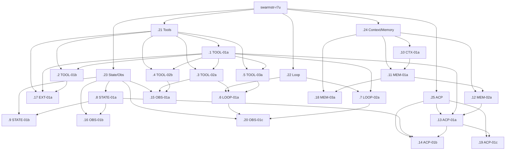

# src → metiq transfer: dependency graph and execution plan

## Current beads structure

Root epic:
- `swarmstr-r7u` — Port the highest-value src agent-platform contracts into metiq

Workstream epics:
- `swarmstr-r7u.21` — Workstream: tool contracts, validation, and assembly
- `swarmstr-r7u.22` — Workstream: shared loop safety and scheduling
- `swarmstr-r7u.23` — Workstream: runtime state and observability
- `swarmstr-r7u.24` — Workstream: context and memory contracts
- `swarmstr-r7u.25` — Workstream: ACP worker runtime inheritance

## Sub-epic breakdown

### `swarmstr-r7u.21` Tool contracts, validation, and assembly
- `swarmstr-r7u.1` — TOOL-01a Introduce normalized tool descriptor types
- `swarmstr-r7u.2` — TOOL-01b Register plugin tools with provider-visible definitions
- `swarmstr-r7u.3` — TOOL-02a Add input validation before tool execution
- `swarmstr-r7u.4` — TOOL-02b Replace single middleware with phased execution hooks
- `swarmstr-r7u.5` — TOOL-03a Add execution traits to the descriptor
- `swarmstr-r7u.17` — EXT-01a Create one authoritative tool assembly path

### `swarmstr-r7u.22` Shared loop safety and scheduling
- `swarmstr-r7u.6` — LOOP-01a Partition tool execution by declared safety
- `swarmstr-r7u.7` — LOOP-02a Integrate loop detection into the shared loop path

### `swarmstr-r7u.23` Runtime state and observability
- `swarmstr-r7u.8` — STATE-01a Add terminal outcome and continuation reason enums
- `swarmstr-r7u.9` — STATE-01b Persist outcome metadata alongside HistoryDelta
- `swarmstr-r7u.15` — OBS-01a Add tool lifecycle event types
- `swarmstr-r7u.16` — OBS-01b Add minimal structured turn telemetry
- `swarmstr-r7u.20` — OBS-01c Expose scheduler and loop-block decisions

### `swarmstr-r7u.24` Context and memory contracts
- `swarmstr-r7u.10` — CTX-01a Add a cache-safe prompt assembly seam
- `swarmstr-r7u.11` — MEM-01a Add model-facing memory packaging
- `swarmstr-r7u.12` — MEM-02a Add scoped worker/agent memory
- `swarmstr-r7u.18` — MEM-03a Defer LLM memory reranking until retrieval quality is measured

### `swarmstr-r7u.25` ACP worker runtime inheritance
- `swarmstr-r7u.13` — ACP-01a Enrich ACP task payloads with inherited runtime hints
- `swarmstr-r7u.14` — ACP-01b Preserve worker history continuity and completion metadata
- `swarmstr-r7u.19` — ACP-01c Add lifecycle cleanup contracts for ACP workers

## Ready work now

Ready implementation tasks right now:
- `swarmstr-r7u.1` — TOOL-01a
- `swarmstr-r7u.8` — STATE-01a
- `swarmstr-r7u.10` — CTX-01a

These are the only leaf tasks with no active `blocks` dependencies.

Note on `bd ready` behavior after nesting:
- `bd ready --parent swarmstr-r7u` now surfaces the workstream epics.
- To get claimable leaf work, query each workstream epic directly.

Useful commands:
```bash
bd ready --json --parent swarmstr-r7u.21 --type task
bd ready --json --parent swarmstr-r7u.22 --type task
bd ready --json --parent swarmstr-r7u.23 --type task
bd ready --json --parent swarmstr-r7u.24 --type task
bd ready --json --parent swarmstr-r7u.25 --type task
```

## Ordered execution waves

This is the leaf-task execution order implied by the current `blocks` graph.

### Wave 0 — start immediately
- `swarmstr-r7u.1` — TOOL-01a
- `swarmstr-r7u.8` — STATE-01a
- `swarmstr-r7u.10` — CTX-01a

### Wave 1 — unlocked by the foundations
- `swarmstr-r7u.2` — TOOL-01b (`blocks`: `.1`)
- `swarmstr-r7u.3` — TOOL-02a (`blocks`: `.1`)
- `swarmstr-r7u.4` — TOOL-02b (`blocks`: `.1`)
- `swarmstr-r7u.5` — TOOL-03a (`blocks`: `.1`)
- `swarmstr-r7u.7` — LOOP-02a (`blocks`: `.1`)
- `swarmstr-r7u.9` — STATE-01b (`blocks`: `.8`)
- `swarmstr-r7u.11` — MEM-01a (`blocks`: `.10`)
- `swarmstr-r7u.16` — OBS-01b (`blocks`: `.8`)

### Wave 2 — second-order work
- `swarmstr-r7u.6` — LOOP-01a (`blocks`: `.3`, `.5`)
- `swarmstr-r7u.12` — MEM-02a (`blocks`: `.11`)
- `swarmstr-r7u.15` — OBS-01a (`blocks`: `.3`, `.4`)
- `swarmstr-r7u.17` — EXT-01a (`blocks`: `.1`, `.2`)
- `swarmstr-r7u.18` — MEM-03a (`blocks`: `.11`)

### Wave 3 — cross-workstream integration
- `swarmstr-r7u.13` — ACP-01a (`blocks`: `.1`, `.12`)
- `swarmstr-r7u.20` — OBS-01c (`blocks`: `.6`, `.7`)

### Wave 4 — ACP completion
- `swarmstr-r7u.14` — ACP-01b (`blocks`: `.13`, `.8`)
- `swarmstr-r7u.19` — ACP-01c (`blocks`: `.13`)

## Blocker map by issue

### Tool workstream
- `swarmstr-r7u.1` — ready
- `swarmstr-r7u.2` — blocked by `swarmstr-r7u.1`
- `swarmstr-r7u.3` — blocked by `swarmstr-r7u.1`
- `swarmstr-r7u.4` — blocked by `swarmstr-r7u.1`
- `swarmstr-r7u.5` — blocked by `swarmstr-r7u.1`
- `swarmstr-r7u.17` — blocked by `swarmstr-r7u.1`, `swarmstr-r7u.2`

### Loop workstream
- `swarmstr-r7u.6` — blocked by `swarmstr-r7u.3`, `swarmstr-r7u.5`
- `swarmstr-r7u.7` — blocked by `swarmstr-r7u.1`

### State / observability workstream
- `swarmstr-r7u.8` — ready
- `swarmstr-r7u.9` — blocked by `swarmstr-r7u.8`
- `swarmstr-r7u.15` — blocked by `swarmstr-r7u.3`, `swarmstr-r7u.4`
- `swarmstr-r7u.16` — blocked by `swarmstr-r7u.8`
- `swarmstr-r7u.20` — blocked by `swarmstr-r7u.6`, `swarmstr-r7u.7`

### Context / memory workstream
- `swarmstr-r7u.10` — ready
- `swarmstr-r7u.11` — blocked by `swarmstr-r7u.10`
- `swarmstr-r7u.12` — blocked by `swarmstr-r7u.11`
- `swarmstr-r7u.18` — blocked by `swarmstr-r7u.11`

### ACP workstream
- `swarmstr-r7u.13` — blocked by `swarmstr-r7u.1`, `swarmstr-r7u.12`
- `swarmstr-r7u.14` — blocked by `swarmstr-r7u.13`, `swarmstr-r7u.8`
- `swarmstr-r7u.19` — blocked by `swarmstr-r7u.13`

## Critical paths

Primary critical path:
- `swarmstr-r7u.10` → `swarmstr-r7u.11` → `swarmstr-r7u.12` → `swarmstr-r7u.13` → `swarmstr-r7u.14`

Secondary critical path:
- `swarmstr-r7u.1` → `swarmstr-r7u.3` + `swarmstr-r7u.5` → `swarmstr-r7u.6` → `swarmstr-r7u.20`

Tool assembly side path:
- `swarmstr-r7u.1` → `swarmstr-r7u.2` → `swarmstr-r7u.17`

## Recommended first tranche

Start these three tasks in parallel:
1. `swarmstr-r7u.1` — unlocks most of the tool and loop graph.
2. `swarmstr-r7u.8` — unlocks state persistence, telemetry, and part of ACP.
3. `swarmstr-r7u.10` — unlocks the full memory path and ACP inheritance.

After that:
- move immediately to `.3`, `.4`, `.5`, `.7`, `.9`, `.11`, and `.16`
- keep `.11` moving because the ACP chain is memory-gated
- keep `.3` and `.5` moving because scheduler observability is tool-gated

## Mermaid dependency graph



## Operational guidance

If you want beads itself to show claimable work cleanly, use the workstream epics as the unit of navigation and the task-level ready query as the unit of execution.

Recommended workflow:
```bash
bd show swarmstr-r7u
bd children swarmstr-r7u --json
bd ready --json --parent swarmstr-r7u.21 --type task
bd ready --json --parent swarmstr-r7u.23 --type task
bd ready --json --parent swarmstr-r7u.24 --type task
```

This avoids the top-level `bd ready` result being dominated by the new sub-epics themselves.
